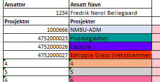

# Timeføring

Høyst uoffisielt Timeføringsark for arbeid på prosjekter ved NMBU

For å laste ned dokumentet trykk her: [timeføring](Timeføring_MAL.xlsx) og trykk på "Download"

## Prosjektoppsett:

Første gang du bruker arket må du føre inn prosjektene du jobber med, skriv prosjektnummerne du bruker til timeføring i UBW i fanen *Prosjektnummer* og et Enkelt og unikt navn i fanen *Prosjekter. Etter du har gitt prosjekter navn bør du ikke endre nanvet! Da vil timer du har ført tidligere ikke bli tatt med (du kan endre prosjektnummeret i ettertid)*

## Timebudsjett:

Før inn timer du har fått budsjettert i fanen *budsjettert, så vil du ha oversikt over hvor mange tiumer du har igjen på prosjekter*

## Ny Uke

For hver nye uke må man lage ny uke, bruk knappen *Ny Uke* under prosjektlisten

Du får da spørsmål om du vil lage et nytt ark for denne uken,

Trykker du ja blir det laget et timeark for denne uken, Trykker du nei blir du spurt om hvilken uke du vil lage timeark for:

## Timeføring

For hver dag kan du velge prosjekter du vil føre timer på i en dropdown meny

Prosjektnavnene blir da hentet fra prosjektene du skrev ned i prosjektkolonnen du kan da velge prosjektet du har jobbet på, 

Og dra det nedover eller bortover for å “skrive” timer

Timene for hver dag blir da fyllt ut i området under timelisten 

Når du skal føre timer i ubw kan du da bare skrive inn første dato i uken, kopiere prosjektnummeret og føre inn dag for dag. 

Det er lurt å krysse av “REG” når du har registrert timene dine for en uke.  

## Oversikt

Når du fører timer så oppdares oversikten automatisk, og du ser enkelt hvor mange timer du har brukt totalt, og om du nærmer deg timegrensen i budsjettet. 

## Endring av år.

For å endre årstall, lag en ny kopi av malen, kopier inn prosjektene dine og endre årstallet i fanen fanen “Timeliste”

